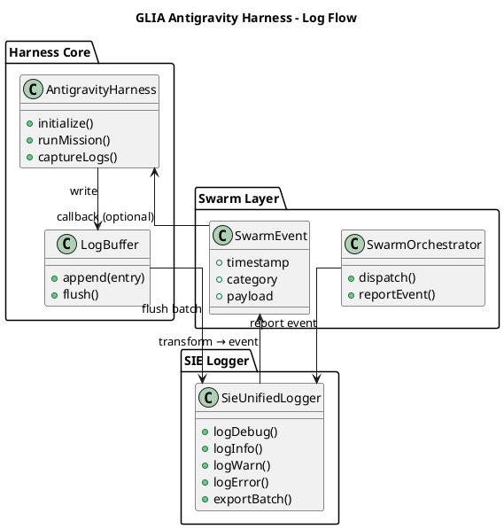

# GLIA Antigravity Harness – Log Flow Diagram

```plantuml
@startuml
title GLIA Antigravity Harness – Log Flow

skinparam shadowing false
skinparam linetype ortho
skinparam defaultTextAlignment center

package "Harness Core" {
  class AntigravityHarness {
    +initialize()
    +runMission()
    +captureLogs()
  }

  class LogBuffer {
    +append(entry)
    +flush()
  }
}

package "SIE Logger" {
  class SieUnifiedLogger {
    +logDebug()
    +logInfo()
    +logWarn()
    +logError()
    +exportBatch()
  }
}

package "Swarm Layer" {
  class SwarmOrchestrator {
    +dispatch()
    +reportEvent()
  }

  class SwarmEvent {
    +timestamp
    +category
    +payload
  }
}

AntigravityHarness --> LogBuffer : write
LogBuffer --> SieUnifiedLogger : flush batch
SwarmOrchestrator --> SieUnifiedLogger : report event
SieUnifiedLogger --> SwarmEvent : transform → event
SwarmEvent --> AntigravityHarness : callback (optional)

@enduml
```
