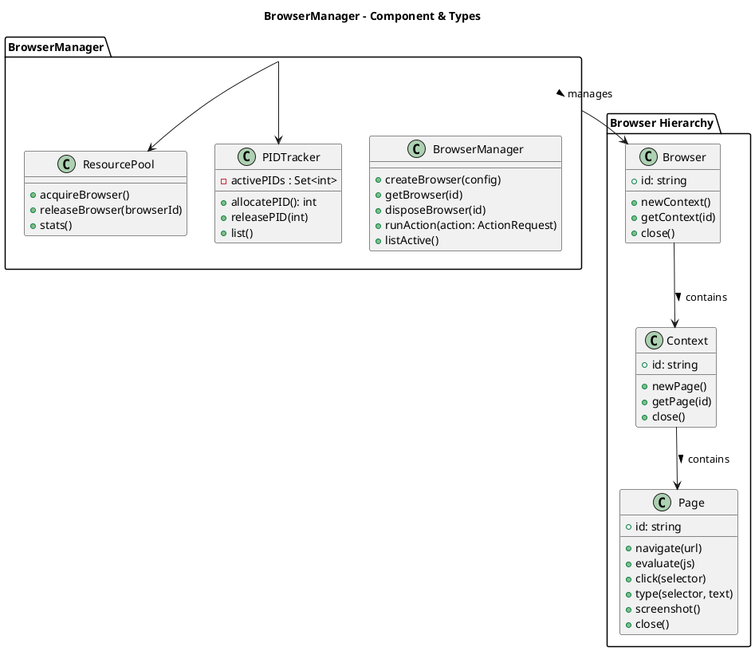
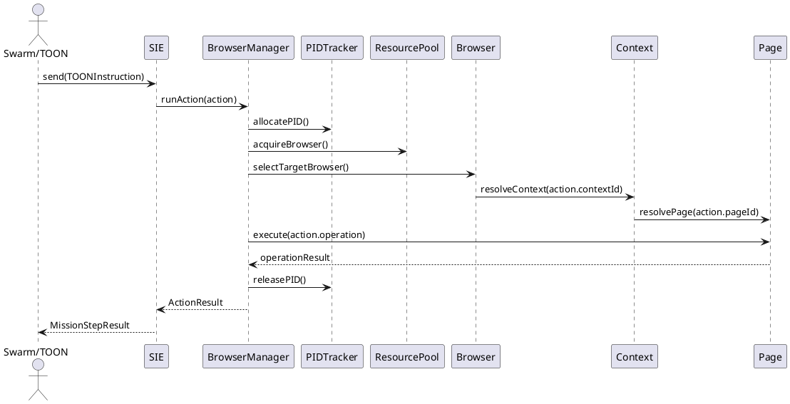
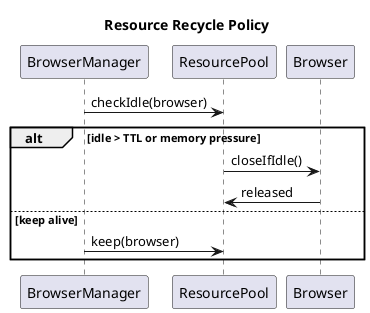
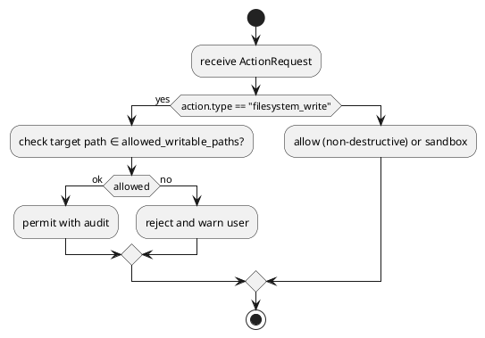

# GLIA — BrowserManager (Complete UML)

## 1. コンポーネント図

```plantuml
@startuml BrowserManager_Component
title BrowserManager - Component & Types

package "BrowserManager" {
  class BrowserManager {
    +createBrowser(config)
    +getBrowser(id)
    +disposeBrowser(id)
    +runAction(action: ActionRequest)
    +listActive()
  }
  class ResourcePool {
    +acquireBrowser()
    +releaseBrowser(browserId)
    +stats()
  }
  class PIDTracker {
    -activePIDs : Set<int>
    +allocatePID(): int
    +releasePID(int)
    +list()
  }
}

package "Browser Hierarchy" {
  class Browser {
    +id: string
    +newContext()
    +getContext(id)
    +close()
  }
  class Context {
    +id: string
    +newPage()
    +getPage(id)
    +close()
  }
  class Page {
    +id: string
    +navigate(url)
    +evaluate(js)
    +click(selector)
    +type(selector, text)
    +screenshot()
    +close()
  }
}

BrowserManager --> ResourcePool
BrowserManager --> PIDTracker
BrowserManager --> Browser : manages >
Browser --> Context : contains >
Context --> Page : contains >
@enduml
```

## 2. runAction Dispatch シーケンス（TOON → SIE → BrowserManager → Page）

```plantuml
@startuml BrowserManager_Dispatch
actor "Swarm/TOON" as Client
participant "SIE" as SIE
participant "BrowserManager" as BM
participant "PIDTracker" as PID
participant "ResourcePool" as RP
participant "Browser" as B
participant "Context" as C
participant "Page" as P

Client -> SIE : send(TOONInstruction)
SIE -> BM : runAction(action)
BM -> PID : allocatePID()
BM -> RP : acquireBrowser()
BM -> B : selectTargetBrowser()
B -> C : resolveContext(action.contextId)
C -> P : resolvePage(action.pageId)
BM -> P : execute(action.operation)
P --> BM : operationResult
BM -> PID : releasePID()
BM --> SIE : ActionResult
SIE --> Client : MissionStepResult
@enduml
```

## 3. リソースリサイクル & ポリシー

```plantuml
@startuml Resource_Recycle
title Resource Recycle Policy

participant BrowserManager
participant ResourcePool
participant Browser

BrowserManager -> ResourcePool : checkIdle(browser)
alt idle > TTL or memory pressure
  ResourcePool -> Browser : closeIfIdle()
  Browser -> ResourcePool : released
else keep alive
  BrowserManager -> ResourcePool : keep(browser)
end
@enduml
```

## 4. runAction のセーフティ（書き込み制限） : 簡易フローチャート

```plantuml
@startuml Safety_Flow
start
:receive ActionRequest;
if (action.type == "filesystem_write") then (yes)
  :check target path ∈ allowed_writable_paths?;
  if (allowed) then (ok)
    :permit with audit;
  else (no)
    :reject and warn user;
  endif
else
  :allow (non-destructive) or sandbox;
endif
stop
@enduml
```
