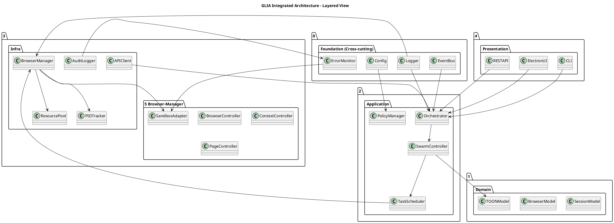
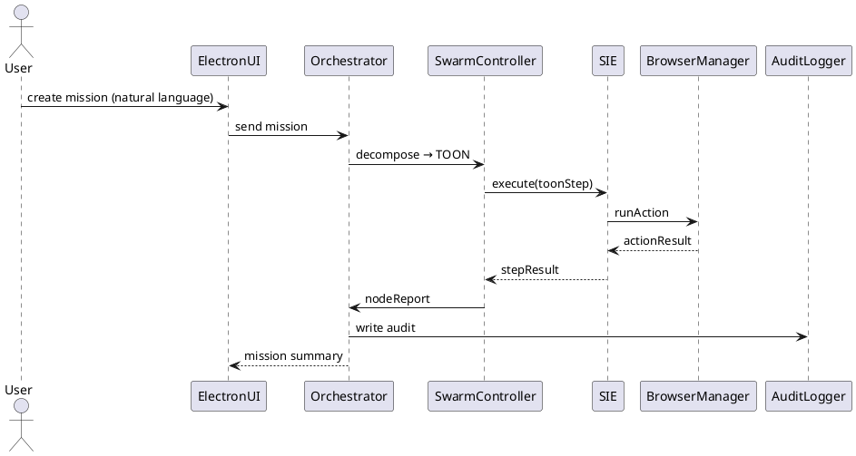

# GLIA Integrated Architecture

## 1. Layered View

```plantuml
@startuml GLIA_Integrated_Architecture
title GLIA Integrated Architecture - Layered View

package "0. Foundation (Cross-cutting)" {
  class Logger
  class Config
  class EventBus
  class ErrorMonitor
}
package "1. Domain" {
  class SessionModel
  class BrowserModel
  class TOONModel
}
package "2. Application" {
  class Orchestrator
  class SwarmController
  class TaskScheduler
  class PolicyManager
}
package "3. Infra" {
  class BrowserManager
  class ResourcePool
  class PIDTracker
  class APIClient
  class AuditLogger
}
package "3.5 Browser-Manager" {
  class BrowserController
  class ContextController
  class PageController
  class SandboxAdapter
}
package "4. Presentation" {
  class CLI
  class ElectronUI
  class RESTAPI
}

' Relations
Orchestrator --> SwarmController
SwarmController --> TaskScheduler
SwarmController --> TOONModel
TaskScheduler --> BrowserManager
BrowserManager --> ResourcePool
BrowserManager --> PIDTracker
BrowserManager --> SandboxAdapter
APIClient --> Orchestrator
AuditLogger --> ErrorMonitor
ElectronUI --> Orchestrator
CLI --> Orchestrator
RESTAPI --> Orchestrator
EventBus --> Orchestrator
Config --> PolicyManager

' cross-layer links
Logger --> Orchestrator
Logger --> BrowserManager
ErrorMonitor --> SandboxAdapter
@enduml
```

## 2. ハイレベル・シーケンス（ユーザーがミッションを投げる流れ）

```plantuml
@startuml Integrated_Sequence
actor "User" as U
participant "ElectronUI" as UI
participant "Orchestrator" as O
participant "SwarmController" as S
participant "SIE" as SIE
participant "BrowserManager" as BM
participant "AuditLogger" as AL

U -> UI : create mission (natural language)
UI -> O : send mission
O -> S : decompose → TOON
S -> SIE : execute(toonStep)
SIE -> BM : runAction
BM --> SIE : actionResult
SIE --> S : stepResult
S -> O : nodeReport
O -> AL : write audit
O --> UI : mission summary
@enduml
```
