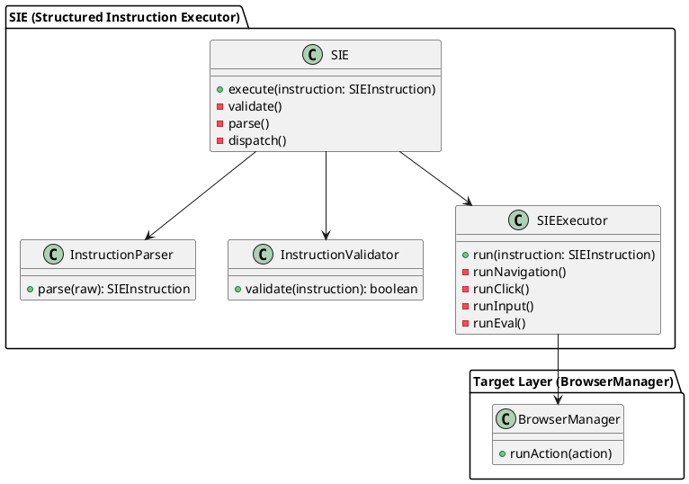
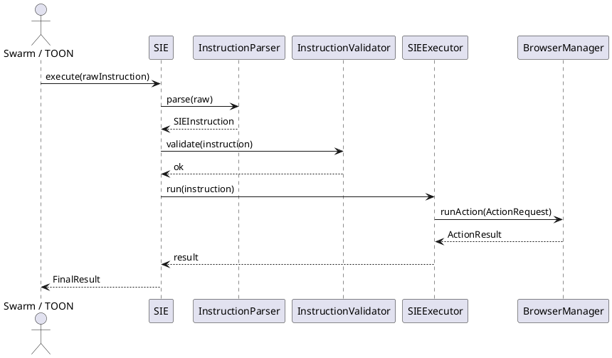
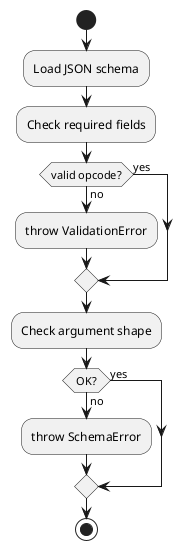
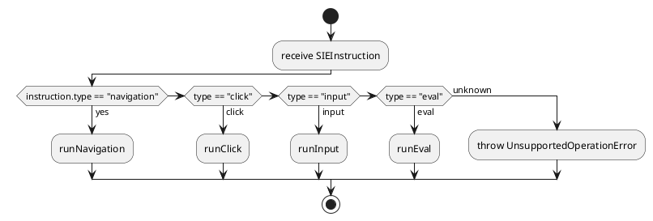
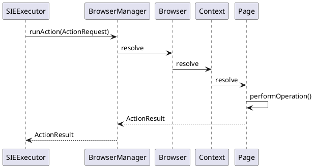

# SIE Executor – UML (Complete)

---

## 1. SIE 全体コンポーネント構造図

## 2. SIE Instruction Life-Cycle Sequence

## 3. Instruction Validation Flow

## 4. Executor Operation Dispatch

## 5. Action Delegation to BrowserManager

