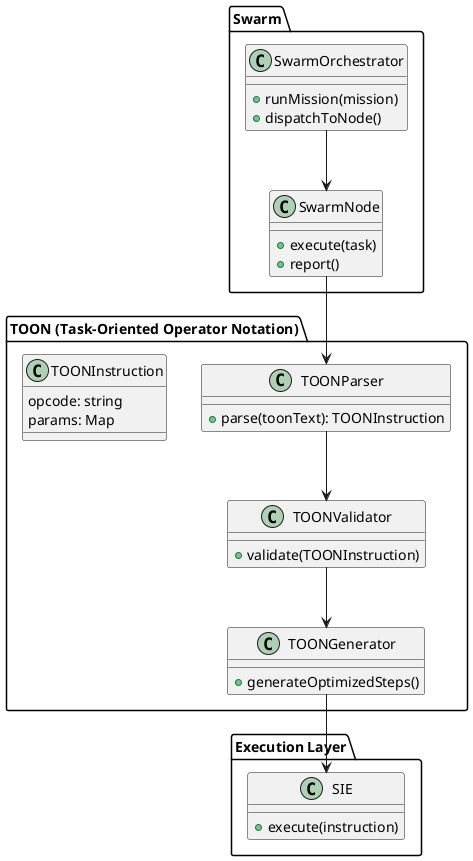
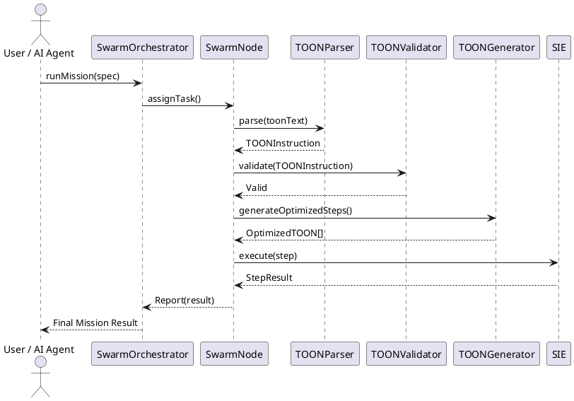
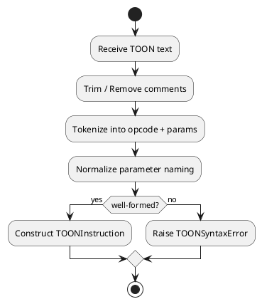
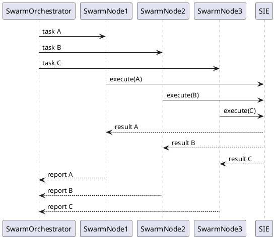
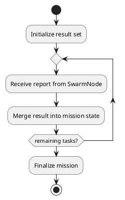

# Swarm × TOON – UML (Complete)

---

## 1. 全体アーキテクチャ構造

## 2. Swarm Mission Execution Sequence

## 3. TOON Instruction Normalization Flow

## 4. Swarm Node Task Dispatch (Parallel)

## 5. Mission Completion Aggregation

