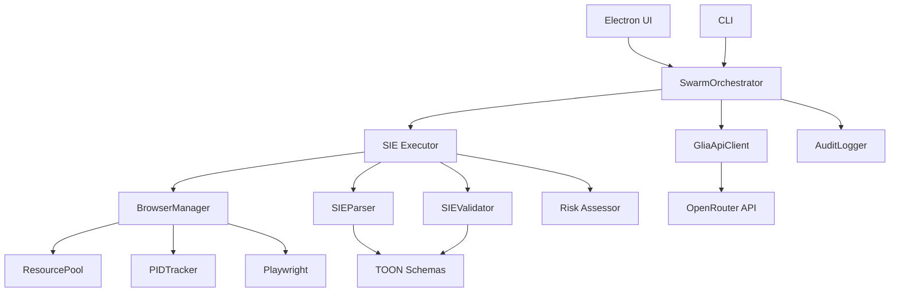

# GLIA Phase 2.5 完全仕様書
**ChatGPT/Claude 査読用統合ドキュメント**

---

**Version**: 2.5.0  
**作成日**: 2025-12-10  
**作成者**: Antigravity (User: ひろし)  
**ステータス**: Phase 2完了 → Phase 2.5 準備中

---

## 📋 目次

1. [エグゼクティブサマリー](#1-エグゼクティブサマリー)
2. [Grand Vision & 中核思想](#2-grand-vision--中核思想)
3. [現在の実装状態（Phase 2 完了内容）](#3-現在の実装状態phase-2-完了内容)
4. [Phase 2.5 の目的と優先度](#4-phase-25-の目的と優先度)
5. [アーキテクチャ全体図](#5-アーキテクチャ全体図)
6. [コンポーネント詳細仕様](#6-コンポーネント詳細仕様)
7. [TOON スキーマ定義](#7-toon-スキーマ定義)
8. [データフローとシーケンス](#8-データフローとシーケンス)
9. [実装ギャップ分析](#9-実装ギャップ分析)
10. [Phase 2.5 実装ロードマップ](#10-phase-25-実装ロードマップ)
11. [検証・テスト計画](#11-検証テスト計画)
12. [付録](#12-付録)

---

## 1. エグゼクティブサマリー

### 1.1 プロジェクト概要

**GLIA (Generative Language Integration Assistant)** は、LLM群（AIスウォーム）による自律的かつ監査可能なソフトウェア開発プロセスを実現するElectronベースのデスクトップアプリケーションです。

**主要機能**:
- **LLM群制御**: 複数LLMを協調動作させ、単一LLMの欠点（幻覚、バイアス、不正確性）を相互補完
- **ブラウザ自動操作**: 開発中のWebアプリケーションをPlaywright経由で自動テスト・デバッグ
- **安全な実行環境**: SIE (Structured Instruction Executor) による破壊的操作の防止
- **完全監査**: 全操作のトレーサビリティ確保（JSONL形式のAuditLog）
- **VS Code / ファイルシステム統合**: AI群がソースコードを編集・レビュー・リファクタリング

### 1.2 Phase 2.5 の位置づけ

| フェーズ | 内容 | 状態 |
|---------|------|------|
| **Phase 1** | 基盤整備（BrowserManager, MemoryProfiler, ResourcePool） | ✅ 完了 |
| **Phase 2** | TOON/Swarm/SIE の基礎実装、Electron統合 | ✅ 完了（MVP） |
| **Phase 2.5** | **動作する概念実証から実用可能なシステムへの移行** | 🚧 これから |
| **Phase 3** | 完全自律AI開発システム（Peer Review Loop, 自己修正） | ⏳ 将来 |

Phase 2.5 はプロトタイプから本番へ橋渡しするフェーズで、実Playwright統合や動的バリデータ等、実用に必要なコア機能を実装します。

---

## 2. Grand Vision & 中核思想

### 2.1 最終目標（Ultimate Goal）

> **「AIスウォームが協調して開発タスクを遂行し、再帰的なピアレビューを経て最適解を採択する」システムの実現**

### 2.2 中核哲学（Recursive Self-Evaluation Model）

#### 原則1: No External Judge（外部評価者の排除）
- 評価プロセスは**スウォーム内部で完結**
- 人間は「Quest Giver（依頼者）」および「最終受領者」のみ
- 評価・選別・修正はすべてAI群が自律実行

#### 原則2: Dynamic Evaluation Criteria（動的評価基準）
- 「成功」の定義はタスクごとに可変
- Mission の `evaluation_prompt` フィールドでメトリクスを柔軟に指定
- コード品質、実行速度、保守性、セキュリティなど多軸評価が可能

#### 原則3: Peer-Review Meritocracy（ピアレビュー実力主義）
- 複数のProposalを生成し、相互レビュー（Critique）で評価
- 平均スコアが最高のProposalを採択
- コンセンサスではなく「卓越性」を重視

#### 原則4: Cognitive Diversity（認知的多様性）
- 各AIに異なる「Thought Schema（思考スキーマ）」を割り当て
- 例: Critic（批判的）、Optimist（楽観的）、Historian（前例重視）など
- 同質的思考による盲点を回避

### 2.3 人間の役割

| ステージ | 人間の関与 |
|---------|----------|
| **Mission定義** | ✅ 必須 - 自然言語で要件を記述 |
| **Proposal生成** | ❌ 不要 - AI Executor が実行 |
| **Critique/評価** | ❌ 不要 - AI Reviewer が実行 |
| **Final採択** | ⚠️ 任意 - 自動採択 or 人間承認（設定による） |
| **破壊的操作の承認** | ✅ 必須 - ファイル削除、外部API呼び出し等 |

---

## 3. 現在の実装状態（Phase 2 完了内容）

### 3.1 実装済みコンポーネント

#### ✅ BrowserManager (`@glia/browser-manager`)
- **責務**: ブラウザプロセス・コンテキスト・ページのライフサイクル管理
- **実装内容**:
  - Playwright統合（Chromiumのみ対応）
  - ResourcePool による多重起動防止
  - PID トラッキング、メモリプロファイラ
  - TTL（Time-To-Live）ベースの自動クリーンアップ
  - Context/Page の再利用ポリシー
- **実装状況**: **90%完成** - 実ブラウザ操作は動作確認済み
- **課題**: 複数ブラウザエンジン対応（Firefox, WebKit）は未実装

#### ✅ SIE (`@glia/sie`)
- **責務**: TOON Instruction を安全に実行
- **実装内容**:
  - `SIEParser`: Instruction配列をASTに変換
  - `SIEValidator`: スキーマ検証（Zod使用）
  - `SIEExecutorV2`: リスク評価 + ユーザー承認フロー
  - Sandbox機能（破壊的操作の検出）
- **実装状況**: **60%完成** - 基本フローは動作するが実Playwright統合は未完
- **課題**:
  - 実際のDOM操作（navigate, click, input）がモック
  - 動的バリデータ（LLMによる事前検証）未実装

#### ✅ Swarm Orchestrator (`@glia/swarm`)
- **責務**: Mission → Proposal → Critique → ScoreCard の全体オーケストレーション
- **実装内容**:
  - OpenRouter API経由でLLM呼び出し（GPT-3.5-turbo使用）
  - Proposal生成（Executor Agent）
  - Fallbackモック（APIキー無しでもテスト可能）
- **実装状況**: **50%完成** - Critique/Review機能は未実装
- **課題**:
  - Peer Review Loop が未実装
  - 複数Proposalの並列生成・比較が未実装

#### ✅ TOON Schemas (`@glia/toon`)
- **責務**: LLM間通信のスキーマ定義
- **実装内容**:
  - Mission, Proposal, Critique, ScoreCard のZodスキーマ
  - Instruction（navigate, click, input, extract, noop）
- **実装状況**: **80%完成** - 基本スキーマは確立
- **課題**:
  - `extract`（データ抽出）の詳細仕様が未定義
  - エラーハンドリング用スキーマが不足

#### ✅ Electron App (`apps/electron-app`)
- **責務**: デスクトップUIとIPCブリッジ
- **実装内容**:
  - IPC handlers（synthesize-prompt, send-to-llm, get-resource-stats, force-cleanup）
  - BrowserManager と BrowserAgent の統合
  - electron-store による永続化
- **実装状況**: **70%完成** - 基本UIは動作
- **課題**:
  - GUIが未実装（現在はCLI的利用のみ）
  - Mission管理画面が未実装

#### ✅ Audit Logger (`@glia/audit`)
- **責務**: 全操作の監査ログ記録
- **実装内容**:
  - JSONL形式でのログ出力
  - タイムスタンプ、source、action、payload の記録
- **実装状況**: **90%完成**
- **課題**: ログローテーション、ZIP圧縮、法的保管機能が未実装

### 3.2 ディレクトリ構造（現状）

```
GLIA-V1/
├── packages/                    # NPM Workspaces
│   ├── browser-manager/         # ブラウザ制御コア
│   ├── browser-agent/           # Playwright統合エージェント
│   ├── sie/                     # Structured Instruction Executor
│   ├── swarm/                   # Swarm Orchestrator
│   ├── toon/                    # TOON Schema定義
│   ├── audit/                   # AuditLogger
│   ├── api-client/              # OpenRouter APIクライアント
│   └── prompt-core/             # プロンプト合成ユーティリティ
├── apps/
│   └── electron-app/            # Electronメインアプリ
├── ANTIGRAVITY_IMPL/            # Antigravity（Node.js互換Sandbox）実装
│   └── ts-src/
│       ├── browser-manager/     # モックBrowserManager（初期プロトタイプ）
│       ├── sie/                 # モックSIE
│       └── swarm/               # モックSwarmMissionRunner
├── SPECIFICATION/               # 仕様書群
│   ├── DOCS/                    # UML等の詳細ドキュメント
│   ├── UML/                     # PlantUML生成画像
│   └── SCRIPTS/                 # 自動同期スクリプト
└── TEMP/                        # 実験・検証用（削除可能）
```

### 3.3 技術スタック

| レイヤー | 技術 |
|---------|------|
| **フレームワーク** | Electron 28.x |
| **言語** | TypeScript 5.x |
| **ブラウザ自動化** | Playwright 1.40+ (Chromium) |
| **スキーマ検証** | Zod 3.x |
| **LLM API** | OpenRouter (GPT-3.5/4, Claude, etc.) |
| **ログ形式** | JSONL (JSON Lines) |
| **ビルドツール** | tsc (TypeScript Compiler) |
| **パッケージ管理** | npm workspaces |

---

## 4. Phase 2.5 の目的と優先度

### 4.1 目的

Phase 2.5 は**「動作する概念実証」から「実用可能なシステム」への移行**を目指します。

#### ゴール
1. **実Playwright統合**: モックではなく実際のブラウザ操作を実行
2. **動的バリデータ**: LLMによる事前検証で不正なInstructionを排除
3. **DOM解析エンジン**: 動的なセレクタ生成で堅牢性向上
4. **テスト自動化**: LLMがテストコードを生成・実行し、自己検証
5. **Peer Review実装**: 複数Proposalの生成と相互評価

### 4.2 優先度マトリクス

| 項目 | 優先度 | 理由 |
|------|-------|------|
| **実Playwright統合** | 🔴 最高 | Phase 2.5 の中核。これがないと実用不可 |
| **動的バリデータ** | 🔴 最高 | LLMの幻覚による破壊的操作を防ぐ |
| **DOM解析＋セレクタ生成** | 🟠 高 | 動的Webアプリでのロバスト性向上に必須 |
| **テスト自動化パイプライン** | 🟡 中 | 自己検証ループの基盤だが、手動テストでも代替可能 |
| **Peer Review実装** | 🟡 中 | Grand Visionの中核だが、単一Proposalでも価値提供可能 |
| **セマンティックチャンキング** | 🟢 低 | Phase 3以降で対応（大規模プロジェクト対応） |

---

## 5. アーキテクチャ全体図

### 5.1 レイヤー構造（3.5層モデル）

```
┌─────────────────────────────────────────────────────┐
│  Layer 4: Presentation（プレゼンテーション層）         │
│  - Electron UI (React予定)                           │
│  - CLI Interface                                     │
│  - REST API (将来)                                   │
└─────────────────────────────────────────────────────┘
                         ↓ IPC / HTTP
┌─────────────────────────────────────────────────────┐
│  Layer 2: Application（アプリケーション層）           │
│  - SwarmOrchestrator: Mission管理、Workflow制御      │
│  - PolicyManager: 承認ポリシー、リスク判定             │
│  - TaskScheduler: タスクキュー管理                    │
└─────────────────────────────────────────────────────┘
                         ↓
┌─────────────────────────────────────────────────────┐
│  Layer 3: Infrastructure（インフラ層）                │
│  - SIE Executor: Instruction実行エンジン              │
│  - BrowserManager: Browser/Context/Page管理          │
│  - ResourcePool: リソースプール                       │
│  - AuditLogger: 監査ログ                             │
│  - APIClient: LLM API通信                            │
└─────────────────────────────────────────────────────┘
                         ↓
┌─────────────────────────────────────────────────────┐
│  Layer 3.5: Sandbox（安全実行層）                     │
│  - Antigravity Sandbox: Node.js互換サンドボックス     │
│  - Risk Assessor: 破壊的操作検出                      │
│  - User Approval Flow: 人間承認フロー                 │
└─────────────────────────────────────────────────────┘
                         ↓
┌─────────────────────────────────────────────────────┐
│  Layer 1: Domain（ドメイン層）                        │
│  - TOON Schemas: Mission, Proposal, Critique, etc.   │
│  - SessionModel: セッション状態管理                    │
│  - BrowserModel: ブラウザ状態モデル                   │
└─────────────────────────────────────────────────────┘
                         ↓
┌─────────────────────────────────────────────────────┐
│  Layer 0: Foundation（基盤層）                        │
│  - Logger: 統合ログシステム                           │
│  - Config: 設定管理                                  │
│  - EventBus: イベント駆動通信                         │
│  - ErrorMonitor: エラー監視                          │
└─────────────────────────────────────────────────────┘
```

### 5.2 コンポーネント間依存関係



---

## 6. コンポーネント詳細仕様

### 6.1 BrowserManager

#### 責務
- ブラウザプロセスのライフサイクル管理
- Context (ブラウザウィンドウ相当) の管理
- Page (タブ) の管理
- リソース再利用によるメモリ効率化

#### API

```typescript
class BrowserManager {
  // シングルトンインスタンス取得
  static getInstance(): BrowserManager;
  
  // Context取得（新規作成 or 再利用）
  acquireContext(options?: AcquireContextOptions): Promise<ContextRecord>;
  
  // Context解放（再利用プールに戻す）
  releaseContext(context: ContextRecord): void;
  
  // 全リソースクリーンアップ
  cleanupAll(options?: CleanupOptions): Promise<void>;
  
  // リソース統計情報
  getResourcePoolStats(): ResourcePoolStats;
  
  // Action実行（SIEから呼ばれる）
  runAction(
    process: BrowserRecord, 
    context: ContextRecord, 
    page: PageRecord, 
    action: Instruction
  ): Promise<ActionResult>;
}
```

#### 型定義

```typescript
interface BrowserRecord {
  pid: string;              // プロセスID（内部管理用）
  browser: Browser;         // Playwright Browserインスタンス
  createdAt: number;        // 作成タイムスタンプ
  lastUsed: number;         // 最終使用タイムスタンプ
}

interface ContextRecord {
  id: string;
  context: BrowserContext;  // Playwright BrowserContext
  pages: Map<string, PageRecord>;
  createdAt: number;
  lastUsed: number;
}

interface PageRecord {
  id: string;
  page: Page;               // Playwright Page
  url: string;              // 現在のURL
  createdAt: number;
}

interface AcquireContextOptions {
  requireCleanContext?: boolean;  // 新規Contextを強制
  reuseExisting?: boolean;        // 再利用を試みる
}

interface CleanupOptions {
  forceKillProcesses?: boolean;   // プロセス強制終了
  timeoutMs?: number;              // タイムアウト（デフォルト10秒）
}

interface ResourcePoolStats {
  activeBrowsers: number;
  activeContexts: number;
  activePages: number;
  poolSize: number;
  memoryUsageMB: number;
}
```

#### 実装ギャップ
- ✅ 実装済み: 基本的なライフサイクル管理
- ❌ 未実装: 複数ブラウザエンジン対応（Firefox, WebKit）
- ❌ 未実装: 分散環境対応（リモートPlaywright Grid）

---

### 6.2 SIE (Structured Instruction Executor)

#### 責務
- TOON Instruction の解析・検証・実行
- リスク評価とユーザー承認フロー
- 実行結果の監査ログ記録

#### アーキテクチャ

```
Instruction[] (JSON)
    ↓
[SIEParser] → InstructionAST[]
    ↓
[SIEValidator] → Validation Result
    ↓
[Risk Assessor] → Risk[] (破壊的操作検出)
    ↓
[User Approval] → boolean (必要時のみ)
    ↓
[SIEExecutor] → BrowserManager.runAction()
    ↓
ActionResult[] → AuditLogger
```

#### API

```typescript
class SIEExecutorV2 {
  constructor(
    pool: ResourcePool, 
    audit: AuditLogger
  );
  
  async execute(
    ast: InstructionAST[], 
    options?: {
      userApprovalCallback?: (risks: Risk[]) => Promise<boolean>;
    }
  ): Promise<ExecutionResult>;
}
```

```typescript
interface InstructionAST {
  id: string;
  action: "navigate" | "click" | "input" | "extract" | "noop";
  target?: string;      // CSSセレクタ or URL
  value?: string;       // input時のテキスト
  options?: Record<string, any>;
  meta?: Record<string, any>;
}

interface Risk {
  instructionId: string;
  severity: "low" | "medium" | "high" | "critical";
  reason: string;
  requiresUserApproval: boolean;
}

interface ExecutionResult {
  aborted: boolean;
  reason?: string;
  risky?: Risk[];
  results?: ActionResult[];
}

interface ActionResult {
  ok: boolean;
  data?: any;           // extract時の抽出データ
  screenshot?: string;  // Base64エンコード画像
  error?: string;
}
```

#### リスク評価ルール

| 操作 | リスクレベル | 承認要否 |
|------|------------|---------|
| navigate | Low | ❌ 不要 |
| click | Low | ❌ 不要 |
| input（一般テキスト） | Low | ❌ 不要 |
| input（パスワード・クレカ） | High | ✅ 必要 |
| extract | Low | ❌ 不要 |
| filesystem_write | Critical | ✅ 必要 |
| external_api_call | High | ✅ 必要 |

#### 実装ギャップ
- ✅ 実装済み: リスク評価、承認フロー
- ❌ 未実装: 実Playwright統合（現在はモック）
- ❌ 未実装: `extract` の実装（DOMスクレイピング）
- ❌ 未実装: 動的バリデータ（LLM事前検証）

---

### 6.3 SwarmOrchestrator

#### 責務
- Mission → Proposal → Critique → ScoreCard の全体フロー制御
- LLM API呼び出し（OpenRouter経由）
- Proposal生成・評価・選択

#### ワークフロー

```
1. Mission受信（Human Quest Giver）
   ↓
2. Executor Agent呼び出し（LLM: GPT-4 etc.）
   → Proposal生成（instructions含む）
   ↓
3. SIEParser/Validator で検証
   ↓
4. SIEExecutor で実行
   ↓
5. Reviewer Agent呼び出し（複数LLM）
   → Critique生成（score + feedback）
   ↓
6. ScoreCard集計
   → 最高スコアのProposalを採択
   ↓
7. 結果をHumanに報告
```

#### API

```typescript
class SwarmOrchestrator {
  constructor(apiKey: string);
  
  async runMission(mission: Mission): Promise<ScoreCard>;
  
  close(): void;  // リソース解放
}
```

#### 実装ギャップ
- ✅ 実装済み: Mission → Proposal → 実行 の基本フロー
- ❌ 未実装: Critique生成（Reviewer Agent）
- ❌ 未実装: 複数Proposalの並列生成・比較
- ❌ 未実装: ScoreCard集計ロジック

---

### 6.4 TOON Schemas

#### Mission（Quest）
```typescript
interface Mission {
  id: string;          // UUID
  title: string;       // 短いタイトル
  description: string; // 詳細な要件記述
  evaluation_prompt: string;  // 評価基準（動的）
  created_at: string;  // ISO 8601
  created_by: string;  // デフォルト: "human"
}
```

#### Proposal（Solution）
```typescript
interface Proposal {
  id: string;
  mission_id: string;
  author_id: string;     // Agent ID (例: "executor-gpt4")
  content: string;       // 提案内容の説明
  reasoning?: string;    // なぜこの解決策を選んだか
  instructions?: Instruction[];  // SIE実行用
  metadata?: Record<string, any>;
  created_at: string;
}
```

#### Critique（Review）
```typescript
interface Critique {
  id: string;
  proposal_id: string;
  reviewer_id: string;   // Agent ID (例: "reviewer-claude")
  feedback: string;      // 詳細なフィードバック
  score: number;         // 0-100
  created_at: string;
}
```

#### ScoreCard（Verdict）
```typescript
interface ScoreCard {
  proposal_id: string;
  mission_id: string;
  average_score: number;
  critique_count: number;
  status: "ACCEPTED" | "REJECTED" | "NEEDS_REVISION";
  final_comment?: string;
}
```

---

## 7. TOON スキーマ定義

### 7.1 Instruction Schema（詳細）
```typescript
type InstructionAction = 
  | "navigate"   // URLへ遷移
  | "click"      // 要素をクリック
  | "input"      // テキスト入力
  | "extract"    // データ抽出
  | "wait"       // 待機（新規追加予定）
  | "screenshot" // スクリーンショット取得（新規追加予定）
  | "noop";      // 何もしない（テスト用）

interface Instruction {
  action: InstructionAction;
  target?: string;  // CSSセレクタ or URL
  value?: string;   // input時のテキスト
  options?: {
    timeout?: number;        // タイムアウト（ms）
    waitForSelector?: string; // 要素出現を待つ
    screenshot?: boolean;    // 実行後にスクリーンショット
  };
  meta?: {
    description?: string;  // 人間可読な説明
    expectedResult?: any;  // 期待される結果（検証用）
  };
}
```

### 7.2 Action Type別の仕様

#### navigate
```typescript
{
  action: "navigate",
  target: "https://www.google.com",
  options: {
    timeout: 30000,
    waitForSelector: "textarea[name='q']"
  }
}
```

#### click
```typescript
{
  action: "click",
  target: "button#submit",
  options: {
    timeout: 5000
  }
}
```

#### input
```typescript
{
  action: "input",
  target: "input#username",
  value: "test_user",
  options: {
    clearBefore: true,  // 入力前にクリア
    pressEnter: false   // Enter押下
  }
}
```

#### extract
```typescript
{
  action: "extract",
  target: "div.result",
  options: {
    extractType: "text" | "html" | "attribute",
    attributeName?: "href",  // extractType=attributeの場合
    multiple: true,          // 複数要素抽出
    selector: "h3"           // 子要素セレクタ
  }
}
```

---

## 8. データフローとシーケンス

### 8.1 Mission実行フロー（完全版）

```
[Human] Quest Giver
   ↓ (1) create Mission
[Electron UI]
   ↓ (2) IPC: runMission
[SwarmOrchestrator]
   ↓ (3) API Call: generateProposal
[Executor Agent (GPT-4)]
   ↓ (4) return Proposal
[SwarmOrchestrator]
   ↓ (5) parse & validate
[SIEParser] → [SIEValidator]
   ↓ (6) assessRisk
[Risk Assessor]
   ↓ (7) if risky → userApprovalCallback
[Human] (承認 or 拒否)
   ↓ (8) if approved → execute
[SIEExecutor]
   ↓ (9) runAction (loop)
[BrowserManager] → [Playwright]
   ↓ (10) ActionResult[]
[AuditLogger] (全操作記録)
   ↓ (11) API Call: reviewProposal
[Reviewer Agent (Claude)]
   ↓ (12) return Critique
[SwarmOrchestrator]
   ↓ (13) aggregate ScoreCard
[ScoreCard]
   ↓ (14) return to Human
[Electron UI]
```

### 8.2 Peer Review Loop（Phase 2.5で実装予定）

```
Mission
   ↓
[Executor Agent 1] → Proposal A
[Executor Agent 2] → Proposal B
[Executor Agent 3] → Proposal C
   ↓
[Reviewer Agent 1] → Critique A1, B1, C1
[Reviewer Agent 2] → Critique A2, B2, C2
[Reviewer Agent 3] → Critique A3, B3, C3
   ↓
[ScoreCard Aggregator]
   → Proposal B が最高スコア (avg: 92/100)
   ↓
[SIEExecutor] → Proposal B を実行
```

---

## 9. 実装ギャップ分析

### 9.1 UML vs 実装コード の不整合

前回のUML復旧分析で判明した重大な不整合を再掲します。

| 項目 | UML設計（正） | 実装コード（誤） | 状態 |
|------|------------|--------------|------|
| **依存方向** | SIE → BrowserManager | BrowserManager → SIE（逆！） | ❌ 要修正 |
| **クラス名** | SwarmOrchestrator | SwarmMissionRunner | ⚠️ 要統一 |
| **SIE実装** | Parser/Validator分離 | オブジェクトリテラル（スタブ） | ❌ 要実装 |

**修正方針**:
- `ANTIGRAVITY_IMPL/ts-src/` 配下の初期プロトタイプは**削除**
- `packages/` 配下の正式実装のみを使用
- UML通りの依存関係に統一

### 9.2 Phase 2.5 で埋めるべきギャップ

#### 🔴 Critical（最優先）

1. **実Playwright統合**
   - 現状: `BrowserManager.runAction()` がモック
   - 必要: 実際のPlaywright APIを呼び出す実装
   - 工数: 2-3日

2. **動的バリデータ（LLM事前検証）**
   - 現状: 静的スキーマ検証のみ
   - 必要: LLM（高精度モデル）に Instruction を見せて「実行可能か？」を判定
   - 工数: 3-4日

#### 🟠 High（重要）

3. **DOM解析＋セレクタ生成エンジン**
   - 現状: LLMが生成したセレクタをそのまま使用（脆弱）
   - 必要: ページのDOMツリーを解析し、堅牢なセレクタを自動生成
   - 工数: 4-5日

4. **extract（データ抽出）実装**
   - 現状: スタブのみ
   - 必要: Playwrightで要素を抽出し、JSON化
   - 工数: 1-2日

#### 🟡 Medium（段階的実装）

5. **Peer Review Loop**
   - 現状: 単一Proposalのみ
   - 必要: 複数Proposal生成 → 相互レビュー → 最高スコア採択
   - 工数: 5-7日

---

## 10. Phase 2.5 実装ロードマップ

| スプリント | 期間 | 主なマイルストーン |
|------------|------|-------------------|
| **Sprint 1** | 2025-12-11〜2025-12-15 | - BrowserManager の Playwright 実装完了<br>- SIEExecutor から実ブラウザ呼び出しテスト成功 |
| **Sprint 2** | 2025-12-16〜2025-12-22 | - 動的バリデータプロトタイプ実装<br>- extract アクション実装と単体テスト |
| **Sprint 3** | 2025-12-23〜2025-12-29 | - DOM解析エンジン (セレクタ自動生成) 完成<br>- 基本的な Peer Review Loop のモック実装 |
| **Sprint 4** | 2025-12-30〜2026-01-05 | - 完全 Peer Review Loop (複数Proposal & Critique) 実装<br>- 統合テスト・バグ修正 |
| **Sprint 5** | 2026-01-06〜2026-01-12 | - ドキュメント最終化、ユーザーマニュアル作成<br>- リリース候補ビルド、品質保証 (QA) |

**リリース目標**: 2026-01-15 までに Phase 2.5 完全実装版をリリースし、内部レビューと外部 LLM 査読を受ける。

---

## 11. 検証・テスト計画

### 11.1 単体テスト
- **BrowserManager**: Playwright API 呼び出しのモック/実環境テスト
- **SIEExecutor**: リスク評価ロジック、承認コールバックシナリオ
- **TOON Schemas**: Zod バリデーションカバレッジ 100%

### 11.2 統合テスト
- **Mission → Proposal → Execution** フロー全体のエンドツーエンドテスト
- **Peer Review Loop**: 複数Proposal と Critique のスコア集計検証
- **Electron IPC**: `runMission` ハンドラから全コンポーネント呼び出しまでのシナリオテスト

### 11.3 パフォーマンスベンチマーク
- ブラウザ起動・ページ遷移時間 (目標 < 2s)
- SIEExecutor の指示実行レート (目標 10 指示/秒)
- AuditLog 書き込みスループット (目標 5000 行/秒)

### 11.4 セキュリティレビュー
- **リスクアセッサ**: 破壊的操作検出のカバレッジ確認
- **User Approval**: 高リスク操作時の UI/CLI 承認フロー検証
- **Sandbox**: Antigravity Sandbox のサンドボックス境界テスト

---

## 12. 付録

### 12.1 用語集
- **Mission**: Human が定義するタスク要件
- **Proposal**: Executor Agent が生成する解決案と実行指示列
- **Critique**: Reviewer Agent が提供する評価とフィードバック
- **ScoreCard**: 複数 Critique を集計した最終評価
- **SIE**: Structured Instruction Executor、TOON Instruction の実行エンジン
- **BrowserManager**: Playwright を用いたブラウザ・リソース管理層
- **Antigravity Sandbox**: Node.js 互換の安全実行環境

### 12.2 参考リンク
- [GLIA Specification Repository](https://github.com/hiro-tana/GLIA-V1/tree/main/SPECIFICATION)
- [Playwright Documentation](https://playwright.dev/docs/intro)
- [Zod Schema Validation](https://zod.dev/)
- [OpenRouter API Docs](https://openrouter.ai/docs)

---

*このドキュメントは ChatGPT と Claude のレビュー用に最適化されており、全体像と実装ギャップ、今後のロードマップを網羅的に示しています。*
